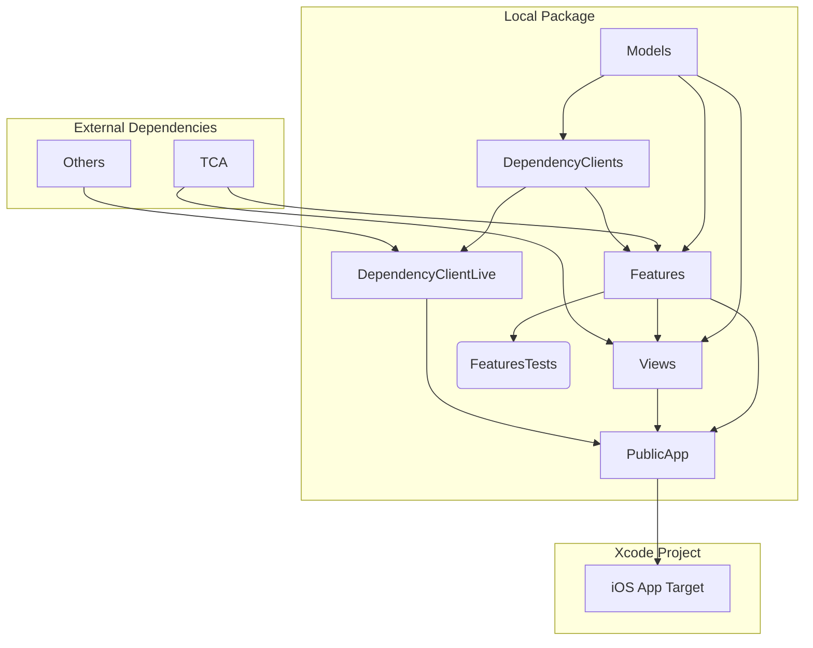
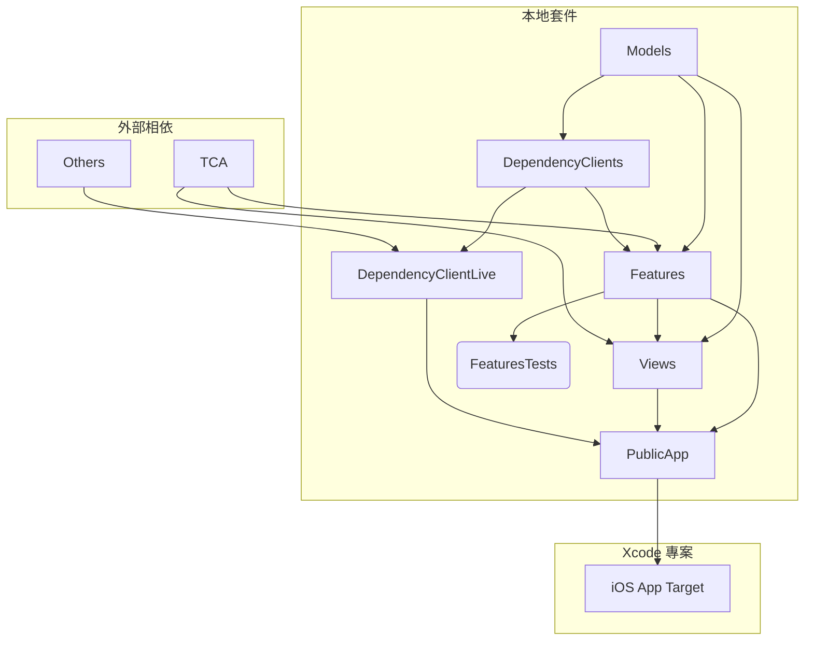

# SwiftUI + TCA Template

[English](#swiftui--tca-template) | [繁體中文](#swiftui--tca-專案模板)

A template project for building iOS/macOS apps with SwiftUI and The Composable Architecture (TCA), featuring a modular package structure for better maintainability and scalability.

## Features

- 📦 Local Swift Package with modular architecture
- 🏗️ The Composable Architecture (TCA) integration
- 🎯 iOS 17 & macOS 14 support
- ✅ Includes test target setup
- 📱 Ready-to-use app structure

## Credit

This template is created by [13](https://github.com/ethanhuang13), who runs iOS Developer+ - a premium Traditional Chinese membership providing advanced and exclusive iOS development content. You can become a member at [iosdeveloper.plus](https://iosdeveloper.plus) and [preview the benefits](https://ethanhuang13.notion.site/ios-developer-plus-benefits).

## Project Structure

The template uses a modular architecture with clear separation of concerns:



### Module Description

- `Models`: Core data models and business logic
- `Features`: TCA features/reducers implementation
- `Views`: SwiftUI views and UI components
- `DependencyClients`: Dependency client protocols
- `DependencyClientsLive`: Live implementations of dependency clients
- `PublicApp`: Main app module that ties everything together

## Getting Started

1. Clone this template repository
2. Update `appName` in `Package.swift`
3. Run `swift package resolve` to fetch dependencies
4. Build and run the project
5. Create an iOS project in Xcode and import the package. The app target only needs an empty Swift file.
6. Develop your app with code organized as modules in the package.

### Tips

1. When adding a new feature, create a new reducer in the `Features`. You can TDD the reducer by adding tests in the `FeaturesTests` module. You can build and test `Features` scheme without building the whole app.
2. When developing a new view, create a new SwiftUI view in the `Views` module. Leverage SwiftUI previews on `Views` to iterate on the view without building the whole app.

## Dependencies

- [The Composable Architecture](https://github.com/pointfreeco/swift-composable-architecture)

## Requirements

- iOS 17.0+ / macOS 14.0+
- Xcode 16.0+
- Swift 6.0+

---

# SwiftUI + TCA 專案模板

[English](#swiftui--tca-template) | [繁體中文](#swiftui--tca-專案模板)

這是一個用於建立 iOS/macOS 應用程式的專案模板，使用 SwiftUI 和 The Composable Architecture (TCA)，具有模組化的套件結構，提供更好的可維護性和擴充性。

## 功能特色

- 📦 具有模組化架構的本地 Swift Package
- 🏗️ 整合 The Composable Architecture (TCA)
- 🎯 支援 iOS 17 與 macOS 14
- ✅ 包含測試目標的設定
- 📱 可立即使用的應用程式結構

## 作者

此模板由 [13](https://github.com/ethanhuang13) 建立。13 經營 iOS Developer+ 繁體中文付費會員，提供進階、獨家的 iOS 開發內容。你可以在 [iosdeveloper.plus](https://iosdeveloper.plus) 訂閱，並在[這裡](https://ethanhuang13.notion.site/ios-developer-plus-benefits)預覽會員內容。

## 專案結構

此模板使用模組化架構，具有清楚的職責分離：



### 模組說明

- `Models`：核心資料模型和商業邏輯
- `Features`：TCA 功能和 reducer 實作
- `Views`：SwiftUI 視圖和 UI 元件
- `DependencyClients`：相依性注入的協定定義
- `DependencyClientsLive`：相依性注入的實際實作
- `PublicApp`：將所有元件組合在一起的主要應用程式模組

## 開始使用

1. 複製此模板專案
2. 在 `Package.swift` 中更新 `appName`
3. 執行 `swift package resolve` 下載相依套件
4. 建置並執行專案
5. 在 Xcode 中建立 iOS 專案並匯入此套件。App target 只需要一個空的 Swift 檔案即可
6. 在套件中以模組方式組織程式碼來開發應用程式

### 開發技巧

1. 新增功能時，在 `Features` 中建立新的 reducer。你可以在 `FeaturesTests` 模組中進行 TDD。你可以單獨編譯和測試 `Features` scheme，無需編譯整個應用程式
2. 開發新視圖時，在 `Views` 模組中建立新的 SwiftUI view。善用 SwiftUI previews 來反覆開發視圖，無需編譯整個應用程式

## 相依套件

- [The Composable Architecture](https://github.com/pointfreeco/swift-composable-architecture)

## 系統需求

- iOS 17.0+ / macOS 14.0+
- Xcode 16.0+
- Swift 6.0+

## Update License into Settings.bundle

```bash
brew install license-plist
license-plist --output-path iPlayground/iPlayground/Settings.bundle
```
